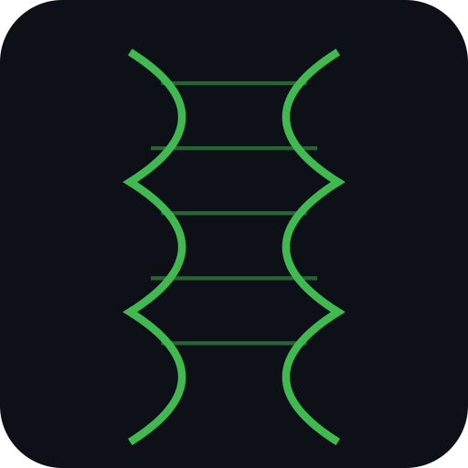

<p align="center">
  
</p>

# 🪨 rosetta

**Python interface to R/Bioconductor — pandas in, pandas out, `.report()` when you're done.**

[](https://pypi.org/project/rosetta-bioc/)
[](https://opensource.org/licenses/MIT)
[]()
[](https://zenodo.org/badge/latestdoi/rosetta-bioc/rosetta)

```bash
pip install rosetta-bioc
```

## 30-second demo

```python
import rosetta as rb

# DESeq2 differential expression — one call, pandas out
results = rb.deseq2(counts_df, metadata_df, design="~ condition")
results.report()
```
```
DESeq2 Results Summary
──────────────────────────────
Total genes tested:      12,000
Significant (padj<0.05): 843 (7.0%)
  ↑ Upregulated:         428
  ↓ Downregulated:       415
LFC range:               [-4.71, 3.50]
```

That's it. No R code. No rpy2 boilerplate. No type conversion. Just results.

## Three-Tier API

| Tier | Style | Functions | Use case |
|------|-------|-----------|----------|
| 1 — Quick | `quick_*()` | `quick_deseq2`, `quick_edger`, `quick_seurat`, `quick_phyloseq` | One-liners for notebooks |
| 2 — Class-based | `Class()` | `Seurat()`, `Phyloseq()` | Stateful, chainable workflows |
| 3 — Functional | `func()` | `run_deseq2()` + `get_results()`, `edger()`, `limma_voom()`, ORA, GSEA | Full control |

```python
# Tier 1 — quick: one call, done
results = rb.quick_deseq2(counts_df, metadata_df, design="~ condition")

# Tier 2 — class-based: build up state, chain methods
seu = rb.Seurat(matrix).normalize().find_clusters().umap()

# Tier 3 — functional: explicit steps, full access
dds = rb.wrappers.deseq2.run_deseq2(counts, meta, design="~ batch + condition")
res = rb.wrappers.deseq2.get_results(dds, lfc_threshold=1.0)
```

## Complete example — copy, paste, run

```python
import pandas as pd
import numpy as np
from rosetta import deseq2

# Simulate RNA-seq counts: 1000 genes, 6 samples (3 control, 3 treated)
np.random.seed(42)
counts = pd.DataFrame(
    np.random.negative_binomial(5, 0.1, size=(1000, 6)),
    index=[f"gene_{i}" for i in range(1000)],
    columns=["ctrl_1", "ctrl_2", "ctrl_3", "treat_1", "treat_2", "treat_3"],
)

metadata = pd.DataFrame(
    {"condition": ["control"] * 3 + ["treated"] * 3},
    index=counts.columns,
)

results = deseq2(counts=counts, metadata=metadata, design="~ condition")
print(results.sort_values("padj").head(10))
```

Requires: Python 3.9+, R 4.0+, and Bioconductor's DESeq2 (`BiocManager::install("DESeq2")`).

## What it wraps

| R Package | Quick API | Class / Functional | What it does |
|-----------|-----------|-------------------|--------------|
| DESeq2 | `rb.quick_deseq2()` | `run_deseq2()` + `get_results()` | Differential expression (negative binomial) |
| edgeR | `rb.quick_edger()` | `rb.edger()` | Quasi-likelihood differential expression |
| limma | — | `rb.limma_voom()` | Linear models + TREAT significance |
| clusterProfiler | — | `rb.enrich_go()`, GSEA | GO/KEGG/Reactome pathway enrichment |
| phyloseq | `rb.quick_phyloseq()` | `Phyloseq()` | Microbiome diversity analysis |
| Seurat | `rb.quick_seurat()` | `Seurat()` | Single-cell RNA-seq |

All functions return a `RosettaDataFrame` (pandas DataFrame subclass) with a `.report()` method.

## Not a toy — full design support

- **Multi-factor designs:** `design="~ batch + condition"`, interaction terms, blocking factors
- **LFC thresholds:** proper hypothesis testing via `lfcThreshold` (not post-hoc filtering)
- **Shrinkage:** apeglm, ashr, normal — via `lfc_shrink()`
- **Contrasts:** `contrast=["genotype", "mutant", "wildtype"]`
- **QC/normalization/outliers:** DESeq2's size factors, Cook's distance, independent filtering all run normally — Rosetta doesn't hide the fitted object
- **Weights, correlations:** limma-voom with `duplicateCorrelation`, sample weights — everything the R function accepts, Rosetta passes through

## Show me the R code

Don't trust a black box? Turn on `codegen` to see exactly what's running:

```python
import rosetta as rb
rb.codegen.enable()

dds = rb.wrappers.deseq2.run_deseq2(counts, meta, design="~ batch + condition")
res = rb.wrappers.deseq2.get_results(dds, lfc_threshold=1.0)
```
```
  R> library(DESeq2)
  R> dds <- DESeqDataSetFromMatrix(countData=counts, colData=metadata, design=~ batch + condition)
  R> dds <- DESeq(dds)
  R> res <- results(dds, alpha=0.1, lfcThreshold=1.0)
```

`rb.codegen.last()` returns it as a string — paste into R to reproduce independently.

## Modular DESeq2 API

For more control, use the step-by-step interface:

```python
from rosetta.wrappers.deseq2 import run_deseq2, get_results, lfc_shrink

dds = run_deseq2(counts_df, metadata_df, design="~ condition")
res = get_results(dds, contrast=["condition", "treated", "control"], alpha=0.05)
shrunk = lfc_shrink(dds, coef="condition_treated_vs_control", type="apeglm")

res.report()
shrunk.report()
```

## Enrichment analysis

```python
import rosetta as rb

# Over-representation analysis
go_results = rb.enrich_go(gene_list, org_db="org.Hs.eg.db", ont="BP")
go_results.report()

# KEGG pathways
kegg = rb.enrich_kegg(gene_list, organism="hsa")
kegg.report()
```

## Setup

**Python side:**
```bash
pip install rosetta-bioc
```

**R side** (one-time):
```bash
Rscript install.R
```

Or manually:
```r
BiocManager::install(c("DESeq2", "edgeR", "limma", "clusterProfiler"))
```

**Posit Cloud:** See [docs/posit-cloud.md](docs/posit-cloud.md) for zero-config setup.

## Requirements

- Python 3.9+
- R 4.0+ with Bioconductor
- rpy2 ≥ 3.5

## Philosophy

1. **Rosetta calls R — it doesn't reimplement it.** All statistics run in the original, validated R packages.
2. **Pandas in, pandas out.** No R objects leak into your Python workflow.
3. **Fail early, fail clearly.** Input validation happens in Python before crossing the R boundary.
4. **`.report()` everything.** Results should be immediately interpretable without manual inspection.
5. **Show your work.** `codegen` prints the equivalent R code so you can verify, reproduce, or learn.

## Contributing

See [CONTRIBUTING.md](CONTRIBUTING.md). Good first issues are labeled — start with [Issue #1: `report()` enhancements](https://github.com/rosetta-bioc/rosetta/issues/1).

## Contributors

- **Catherine Chi Chung** — GSoC 2026 contributor
- **Matias Salibian Barrera** — GSoC co-mentor, UBC Statistics

## Acknowledgments

Built on [rpy2](https://rpy2.github.io/) and the extraordinary R/Bioconductor ecosystem. All credit for the statistical methods goes to the original R package authors.

**Supported by:**
- **Google Summer of Code 2026** — funding Catherine's development work
- **JPMorgan Chase** — startup banking and advisory through their Innovation Economy program
- **AWS** — quantum computing infrastructure via Amazon Braket
- **Nodes Bio, Inc.** — project lead, CI/hosting, and engineering

GSoC 2026 · MIT License · [Nodes Bio](https://nodes.bio)
