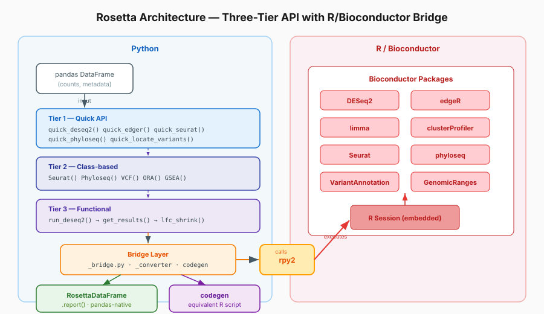

# Summary

Rosetta is a Python library that provides a clean, pandas-native interface to
R/Bioconductor statistical packages for genomics. It wraps validated R
implementations of DESeq2, edgeR, limma, clusterProfiler, Seurat, phyloseq, and
VariantAnnotation — handling all type conversion, R session management, and
result formatting automatically. Users pass pandas DataFrames in and receive
pandas DataFrames out, with a `.report()` method on every result for instant
human-readable summaries.

# Statement of Need

The R/Bioconductor ecosystem contains the most widely-used and rigorously
validated statistical methods for genomics analysis [@huber2015orchestrating].
However, the broader data science and machine learning ecosystem has
consolidated around Python. Researchers who use Python for data wrangling,
visualization, and modeling must currently choose between: (1) maintaining
separate R scripts and managing cross-language data transfer, (2) writing 30–40
lines of rpy2 boilerplate per analysis step [@gautier2010rpy2], or (3) using
Python reimplementations that lack the validation history of the original R
packages.

Rosetta eliminates this friction. A standard DESeq2 differential expression
analysis that requires ~35 lines of rpy2 conversion code reduces to:

```python
import rosetta as rb
results = rb.deseq2(counts_df, metadata_df, design="~ condition")
results.report()
```

Rosetta does not reimplement any statistical method. All computations execute in
R through the original Bioconductor packages, ensuring that results are
identical to those produced by native R workflows. The library handles the
conversion boundary — integer matrix coercion, factor level management, R formula
construction, and DataFrame serialization — so that researchers can focus on
experimental design rather than language interoperability.

# State of the Field

Several approaches exist for using R-based genomics tools from Python:

- **rpy2** [@gautier2010rpy2]: The foundational Python-to-R bridge. Powerful but
  low-level — users must manage type conversions, R namespaces, and memory
  explicitly.
- **pyDESeq2** [@muzellec2023pydeseq2]: A pure-Python reimplementation of DESeq2.
  Useful when R is unavailable, but covers only DESeq2 and cannot guarantee
  identical results to the reference implementation.
- **diffxpy**: A Python differential expression framework using statsmodels.
  Implements its own statistical models rather than calling validated R code.
- **anndata2ri**: Bridges AnnData objects to R SingleCellExperiment, but does not
  provide analysis wrappers.

Rosetta occupies a unique position: it calls the *original* R implementations
(preserving their validation guarantees) while presenting a Pythonic API that
returns standard pandas objects. Unlike rpy2, it requires no R knowledge from
the user. Unlike reimplementations, it produces bit-identical results to native
R workflows. Its `codegen` mode prints the equivalent R code for full
transparency and reproducibility.

# Software Design

{width="100%"}

Rosetta is organized into a Three-Tier API that balances simplicity with control:

- **Tier 1 (Quick API)**: Single-function entry points (`quick_deseq2`,
  `quick_edger`, `quick_seurat`, `quick_phyloseq`) for common workflows with
  sensible defaults. Designed for exploratory analysis and notebooks.
- **Tier 2 (Class-based)**: Stateful, chainable objects (`Seurat()`,
  `Phyloseq()`, `VCF()`) that maintain R object state across method calls.
  Designed for multi-step pipelines.
- **Tier 3 (Functional)**: Explicit step-by-step functions (`run_deseq2()`,
  `get_results()`, `lfc_shrink()`) that map closely to R function signatures.
  Designed for full control over parameters and intermediate objects.

The tiers are not three ways of calling one function; they map to the natural
paradigm of each workflow. Tabular, single-shot analyses such as bulk RNA-seq
differential expression are exposed through the Quick and Functional tiers,
while inherently stateful, iterative workflows such as single-cell (Seurat) and
microbiome (Phyloseq) analysis are exposed as chainable classes. The same
DESeq2 analysis can be run as a one-liner or unpacked into its component steps:

```python
import rosetta as rb

# Tier 1 — one call, summary report
rb.quick_deseq2(counts, metadata, design="~ condition").report()
# DESeq2 Results Summary
# ──────────────────────────────
# Total genes tested:      200
# Significant (padj<0.05): 30 (15.0%)
#   ↑ Upregulated:         30
#   ↓ Downregulated:       0
# LFC range:               [1.71, 3.02]

# Tier 3 — explicit control over intermediate objects
from rosetta import run_deseq2, get_results
dds = run_deseq2(counts, metadata, design="~ condition")
res = get_results(dds, contrast=["condition", "treated", "control"], alpha=0.05)
# res is a pandas DataFrame: baseMean, log2FoldChange, lfcSE, stat, pvalue, padj

# Tier 2 — stateful, chainable workflow for iterative analyses
from rosetta import Seurat
markers = (Seurat(sc_counts)
           .run_standard_pipeline()
           .find_markers(ident_1="0", ident_2="1"))
```

Key architectural decisions:

1. **Validation before crossing the R boundary**: All input validation
   (empty DataFrames, negative counts, mismatched dimensions) occurs in Python
   with clear error messages before any R code executes.
2. **No R objects leak into Python**: Every public function returns pandas
   DataFrames or Python-native types. Internal R object handles are managed
   privately.
3. **Codegen transparency**: The `codegen` module records the equivalent R
   commands for every operation, enabling users to verify, reproduce, or learn
   the underlying R workflow.
4. **Graceful degradation**: Optional R packages (e.g., apeglm, Seurat) are
   checked at runtime with informative messages when missing, rather than
   cryptic R tracebacks.

The library is built on rpy2 [@gautier2010rpy2] and uses a centralized bridge
module for all R-to-Python type conversions, ensuring consistency across
wrappers.

# Research Impact Statement

Rosetta enables Python-based genomics researchers to access Bioconductor's
validated statistical methods without learning R or managing cross-language
complexity. Specific impact vectors include:

- **Reproducibility**: The `codegen` mode generates equivalent R scripts for
  every analysis, allowing independent verification in native R.
- **Education**: Used in teaching materials at the University of British Columbia
  Department of Statistics, lowering the barrier for students entering
  computational genomics.
- **Pipeline integration**: Compatible with Python workflow managers (Snakemake,
  Nextflow via subprocess) and notebook environments (Jupyter, Google Colab,
  Posit Cloud).
- **Community readiness**: 148 tests, CI with R package caching, comprehensive
  documentation, and MIT licensing support community adoption.

The library is actively developed as a Google Summer of Code 2026 project,
with ongoing contributions from the bioinformatics community.

# AI Usage Disclosure

Portions of this software were developed with assistance from AI coding tools
(Kiro CLI, Claude, and Jarvis CLI — the last an AI coding tool developed by the
lead author). All AI-generated code was reviewed, tested, and validated
by the authors. The test suite (148 tests) provides automated verification of
correctness. This paper was drafted with AI assistance and reviewed by all
authors for accuracy.

# Acknowledgements

This work was supported by Google Summer of Code 2026. We thank the authors of
DESeq2, edgeR, limma, clusterProfiler, Seurat, phyloseq, and VariantAnnotation
for their foundational R packages. We thank Amazon Web Services (AWS) for cloud
computing support, and JPMorgan Chase for startup banking and advisory support
through their Innovation Economy program.

# References
